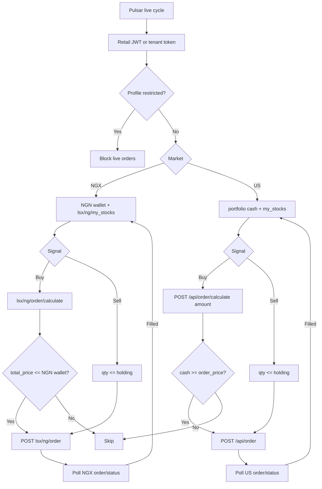

# Bamboo — API Reference for Pulsar Live Broker

> **Purpose:** Map Pulsar’s live-broker capabilities onto Bamboo for **NGX and US** stocks.  
> **Sources:** Powered-by-Bamboo OpenAPI (`reports/bamboo-api.yaml`), Flutter app `libapp.so` (v4.5.8), and live calls against `https://api.investbamboo.com`.  
> **Last updated:** August 2026 (retail live-probed 14 Aug 2026 — GET + calculate only; no place-order)

Wealth’s paths are the **reference implementation**. Bamboo uses **two product APIs**: NGX (`/api/lsx/ng/*`, Naira wallet) and US (`/api/order`, `/api/my_stocks`, `/api/portfolio`, DriveWealth). Do not mix them. Route a Pulsar symbol to NGX vs US **before** quoting or placing.

---

## Table of contents

1. [Capability map (Pulsar ↔ Wealth ↔ Bamboo)](#1-capability-map-pulsar--wealth--bamboo)
2. [Overview](#2-overview)
3. [Authentication & session](#3-authentication--session)
4. [Account / eligibility](#4-account--eligibility)
5. [Spendable cash](#5-spendable-cash)
6. [Book (positions)](#6-book-positions)
7. [Market and instruments](#7-market-and-instruments)
8. [Orders (NGX)](#8-orders-ngx)
9. [US stocks](#9-us-stocks)
10. [Pulsar field mapping](#10-pulsar-field-mapping)
11. [Bot workflow](#11-bot-workflow)
12. [Gaps vs Wealth](#12-gaps-vs-wealth)
13. [Example cURL](#13-example-curl)
14. [Live retail probe (14 Aug 2026)](#14-live-retail-probe-14-aug-2026)

---

## 1. Capability map (Pulsar ↔ Wealth ↔ Bamboo)

### Auth and session

| Capability | What Pulsar needs back | Wealth today | Bamboo |
|---|---|---|---|
| Login | Access token (and refresh if used), optional 2FA | `POST /login` | **Retail:** `POST /api/login` `{ phone_number, password }` → JWT (`typ: access`) + `refresh_token` if present. **Tenant:** `POST /oauth/token` `{ username, password }` + `app-key` → `access_token` (`x-client-token`, 24h). |
| Complete 2FA | Session tokens after OTP | `POST /auth/check-2fa` | **Not a dedicated 2FA login step.** Captcha exists: `POST /api/auth/captcha`. Phone OTP is used for signup / PIN / password reset (`verifyNumber`, `user/sq/verify`), not proven as login 2FA. |
| Refresh session | New access token | `POST /auth/refresh` | **Tenant:** mint a new `x-client-token` via `POST /oauth/token` before 24h. **Retail:** `refresh_token` is in the binary; a dedicated refresh path was **not proven**. On `invalid_token` / `unauthenticated`, re-login. |
| Logout | Invalidate remote session | `POST /auth/logout` | **Not proven** on the consumer API. App only logs out Intercom. Drop the JWT locally. |

### Account / eligibility

| Capability | What Pulsar needs | Wealth today | Bamboo |
|---|---|---|---|
| Profile | Email, display name, KYC / trading-verified flag | `GET /profile` | Shared: `GET /api/profile` (`account_restriction.restricted`) + `GET /api/base_wallet_status`. **NGX:** also `GET /api/lsx/ng/cscs/account/status` → `ready_for_trading`. **US:** `GET /api/portfolio` → `account_restricted`; `extended_hours_status`. Do **not** use `GET /api/kyc_status` as the only gate (can be `not_submitted` while CSCS-ready). **Block** if `restricted` / `account_restricted`. For NGX also require `ready_for_trading`. |
| Spendable cash | Brokerage cash for buys (not net worth) | Profile `brokerage_balance` | **NGX / Naira wallet:** `GET /api/wallet_balance` → NGN row `wallet_balance` (live: ₦4900). Pair with `GET /api/wallet` for ids only. **US / DriveWealth buying power:** `GET /api/portfolio` → `cash` / `dollar_cash` (can be 0 while Naira wallet is funded). **Not** `user_cash_balance` (422). **Not** NGX portfolio breakdown (no cash). `GET /api/user/networth?currency_code=NGN` can equal the wallet when you have no lots — do not treat it as the cash API. |

### Book (Home + cycles)

| Capability | What Pulsar needs per holding | Wealth today | Bamboo |
|---|---|---|---|
| Portfolio / positions | Ticker, qty, avg cost, last/mark, market value | `GET /portfolio?with[]=stocks.stock` | **NGX:** `GET /api/lsx/ng/my_stocks`. **US:** `GET /api/my_stocks` (`symbol`, `quantity`, `cost_basis`, `market_price`, `user_equity`). Per-ticker US lot: `GET /api/stock/{symbol}/ownership`. Totals: NGX breakdown vs `GET /api/portfolio` / `GET /api/portfolio/breakdown` (US `$`). |
| Instrument by id | Ticker when book only has internal id | `GET /stocks/{id}` | Both books use **`symbol`**. **NGX quote:** `GET /api/lsx/ng/stocks/{symbol}`; search `?query=`. **US quote:** `GET /api/stock/{symbol}/details` (retail) or `GET /api/tenant/stock/{symbol}/details` (tenant); search `GET /api/stock/search?query=AAPL`. Catalog: `GET /api/stocks?limit=&next_token=`. |

### Market and instruments (order path)

| Capability | What Pulsar needs | Wealth today | Bamboo |
|---|---|---|---|
| Market open/closed | Boolean before live fills | `GET /market-status` | **NGX:** `GET /api/market/open_date?market=NGX` → `market_session.core_market` (boolean). **US:** `?market=US` or omit query (same US session). `?market=NG` returns **500**. |
| Resolve ticker | Broker instrument id + quote | `GET /stocks?query=…` | **NGX:** `GET /api/lsx/ng/stocks?query=` then `/api/lsx/ng/stocks/{symbol}`. **`search_term` does not filter.** **US:** `GET /api/stock/search?query=` then `/api/stock/{symbol}/details`. Instrument id is the **symbol string**. |
| Pre-trade fee | Fee for qty × price | `POST /stocks/fee` | **NGX:** `POST /api/lsx/ng/order/calculate`. **US:** `POST /api/order/calculate`. Reuse returned `fee`, `quantity`, `price_per_share`, `total_price` on place. |

### Orders

| Capability | What Pulsar needs | Wealth today | Bamboo |
|---|---|---|---|
| Place market buy/sell | Broker order id, status, qty, quote/fill; optional `client_order_id` | `POST /orders` | **NGX:** `POST /api/lsx/ng/order` after calculate. **MARKET only.** **US:** `POST /api/order` after calculate — MARKET (notional `amount`), LIMIT, STOP. Fractional US MARKET. No `client_order_id`. |
| Get order by id | Status, fill price, rejection reason | `GET /portfolio/orders/{id}` | **NGX:** `GET /api/lsx/ng/order/{order_id}/status`. **US:** `GET /api/order/{id}/status` (`order_status`: New / Filled / Cancelled / Rejected). |

### Nice to have

| Capability | Wealth | Bamboo |
|---|---|---|
| List recent / open orders | `GET /portfolio/orders` | `GET /api/lsx/ng/pending_orders`, `GET /api/pending_orders` (US) |
| Fill webhook | — | Partner docs mention Pub/Sub / NG stock events; not required if polling |
| Separate wallet | (on profile) | `GET /api/wallet_balance` for amounts; `GET /api/wallet` for ids |
| Cancel | `POST /orders/{id}/cancel` | `POST /api/lsx/ng/order/{order_id}/cancel` (pending only); US `POST /api/order/{id}/cancel` |

---

## 2. Overview

### Two ways to call Bamboo

| Mode | Base URL | Who authenticates | Headers |
|------|----------|-------------------|----------|
| **Retail (consumer app)** | `https://api.investbamboo.com` | End-user JWT from `POST /api/login` | `Authorization: Bearer <jwt>` · `x-subject-type: standard` · `Accept: application/json` |
| **Tenant (Powered by Bamboo)** | Sandbox: `https://powered-by-bamboo-sandbox.investbamboo.com` (prod host from Bamboo) | Tenant `x-client-token` + per-user `x-user-id` | `x-client-token` · `x-user-id` · `x-subject-type: tenant` · often `x-request-source` · `accept-language: en` |

Path vocabulary is the same (`/api/...`). Pulsar-as-Wealth-clone (user logs into their own brokerage) uses **retail**. Pulsar-as-broker wrapping Bamboo users uses **tenant**.

JWT `sub` is the numeric Bamboo user id. Retail tokens seen in the wild have `aud`/`iss` = `web`, `typ` = `access`, `residence_country` = `NGA`.

### Request conventions

| Convention | Detail |
|------------|--------|
| Prefix | All product routes under `/api/` (not `/v1`) |
| JSON | `application/json`, snake_case |
| NGX vs US | **Never mix.** NGX = `/api/lsx/ng/...` + Naira wallet. US = `/api/order`, `/api/stock/*`, `/api/my_stocks`, `/api/portfolio` + USD buying power |
| Currency | NGX: NGN. Pass `currency: NGN` header on order/portfolio where documented |
| Auth errors | `unauthenticated` · `invalid_token` · `missing required header x-subject-type` |

**Required on every authenticated retail call:**

```http
Authorization: Bearer <access_token>
x-subject-type: standard
Accept: application/json
Content-Type: application/json
```

Tenant calls use `x-subject-type: tenant` and **do not** use the user’s Bearer; they use `x-client-token` + `x-user-id`.

---

## 3. Authentication & session

### 3.1 Retail login (closest to Wealth `POST /login`)

```
POST /api/login
```

**Auth:** No  

**Body:**
```json
{
  "phone_number": "08012345678",
  "password": "your_password"
}
```

Empty/wrong field names return `400 Bad Request`. Wrong password:

```json
{
  "message": "Incorrect phone number or password. Please try again",
  "attempts_remaining": 4
}
```

Success is a JWT access token (and possibly `refresh_token`). Decode `exp` for expiry. Store `sub` as Bamboo user id.

There is **no email login** on this route.

### 3.2 Captcha (not Wealth 2FA)

```
POST /api/auth/captcha
```

Used around registration / bot checks, e.g. `{ "phone_number": "+234…", "operation": "registration" }`. Not a substitute for Wealth `check-2fa`.

### 3.3 Tenant token (Powered-by-Bamboo)

```
POST /oauth/token
Headers: app-key, content-type, accept-language
Body: { "username": "<tenant>", "password": "<secret>" }
```

Response: `{ "access_token", "expires_in": 86400 }` → send as `x-client-token`. Refresh by minting a new token before expiry (max 3/hour).

### 3.4 Logout / refresh

| Need | Status |
|------|--------|
| Refresh | Tenant: re-call `/oauth/token`. Retail: re-login if JWT expired. |
| Logout | No proven invalidate endpoint. Discard tokens. |

---

## 4. Account / eligibility

### 4.1 `GET /api/profile`

Email, `name` / `surname`, `phone_number`, `email_verified`, `engagement_status` (`no_deposit` \| `no_trade` \| `traded`), `account_restriction.restricted` + `reason`.

**Pulsar gate:** do not place live orders if `account_restriction.restricted` is true.

### 4.2 `GET /api/base_wallet_status`

```json
{
  "status": "active",
  "restricted": false,
  "transaction_pin_set": true
}
```

Retail place-order may still require `transaction_pin` (4-digit). Tenant OpenAPI NGX place body does **not** include PIN — tenant integrations skip it.

### 4.3 NGX trading-ready (CSCS)

```
GET /api/lsx/ng/cscs/account/status
```

Live: `{ "status": "Success", "ready_for_trading": true, "account_number": "…" }`

This is the NGX analog of Wealth’s trading-verified flag. **Block live NGX orders unless `ready_for_trading === true`.**

### 4.4 Do not use `GET /api/kyc_status` as the NGX gate

Live this returned `status: not_submitted` on an account that already has CSCS + `ready_for_trading: true` + `engagement_status: traded`. Treat it as US/document KYC, not NGX eligibility.

**Rule:** login success ≠ allowed to trade.

---

## 5. Spendable cash

App copy: *NGX stocks can only be purchased using NGN wallet balance.*

### Naira wallet (what Home shows as Bamboo wallet)

```
GET /api/wallet_balance
```

Live:

```json
{
  "wallet_balance": [
    {
      "name": "Bamboo Base Wallet",
      "currency": "USD",
      "wallet_id": 0,
      "wallet_status": "active",
      "restricted": false,
      "wallet_balance": 0.0
    },
    {
      "name": "Naira Wallet",
      "currency": "NGN",
      "wallet_id": 0,
      "wallet_status": "active",
      "restricted": false,
      "wallet_balance": 4900.0
    }
  ]
}
```

**Pulsar NGX cash = the object with `currency: "NGN"` → `wallet_balance`.** Use that row’s `wallet_id` as `source_wallet_id` on place.

`GET /api/wallet` is the same wallets **without** amounts.

Ledger (optional): `GET /api/wallet/base_wallet_transactions?wallet_id={ngn_wallet_id}` also returns top-level `balance` (same ₦4900) plus `wallet_transactions[]`. Default transactions (no `wallet_id`) are the **USD** base wallet, not NGN.

### Not the Naira wallet

| Path | Live vs ₦4900 |
|------|----------------|
| `GET /api/portfolio` (`cash`, even with `currency: NGN`) | 0 — US brokerage buying power |
| `GET /api/lsx/ng/user_cash_balance/NGN` | 422 |
| `GET /api/lsx/ng/portfolio/breakdown` | equity only |
| `GET /api/user/networth?currency_code=NGN` | `value: 4900` **on this account** because wallet ≈ net worth (no NGX lots). Do not use as the cash endpoint. |

### US brokerage cash

`GET /api/portfolio` (no header, `$`):

| Field | Use |
|-------|-----|
| `cash` / `dollar_cash` | Buying power (USD) |
| `unsettled_cash` | Sale proceeds not withdrawable yet |
| `withdrawal_cash` | Settled, withdrawable |
| `base_wallet_balance` | Bamboo USD wallet |
| `account_restricted` | Hard stop |

Naira NGX buys should **not** use US `dollar_cash`.

---

## 6. Book (positions)

### 6.1 NGX holdings — analog of Wealth portfolio stocks

```
GET /api/lsx/ng/my_stocks
```

```json
{
  "total_user_equity": 0,
  "stocks": [
    {
      "symbol": "ZENITHBANK",
      "name": "ZENITH BANK",
      "quantity": 10,
      "average_cost": 0,
      "cost_basis": 0,
      "market_price": 33.4,
      "percent_change": 0,
      "total_return": 0
    }
  ]
}
```

Live empty book: `{ "currency_symbol": "₦", "equity_value": 0, "stocks": [] }`. When holdings exist, OpenAPI lists `symbol`, `quantity`, `average_cost` / `cost_basis`, `market_price`.

| Pulsar lot field | Bamboo NGX |
|------------------|------------|
| Ticker | `symbol` |
| Qty | `quantity` |
| Avg / buy | `average_cost` (fallback `cost_basis`) |
| Mark | `market_price` |
| Current value | `quantity * market_price` (or equity fields if present) |

### 6.2 NGX breakdown (totals)

```
GET /api/lsx/ng/portfolio/breakdown
```

Live retail body (no cash fields):

```json
{
  "currency": "NGN",
  "change": 0,
  "total_user_equity": 0,
  "total_return": 0,
  "total_cost": 0,
  "total_return_percent_change": 0.0
}
```

Use this for NGX **equity totals**, not buying power.

### 6.3 US holdings

```
GET /api/my_stocks
```

Live empty book: `{ "currency_symbol": "$", "equity_value": 0, "stocks": [] }`.

When funded, OpenAPI `stocks[]`:

| Pulsar lot | Bamboo US |
|------------|-----------|
| Symbol | `symbol` |
| Qty | `quantity` (can be fractional) |
| Avg / cost | `cost_basis` |
| Mark | `market_price` (or `price`) |
| Current value | `user_equity` |

One ticker:

```
GET /api/stock/{symbol}/ownership
```

US cash + AUM (not the lot list): `GET /api/portfolio`, `GET /api/portfolio/breakdown` (`available_to_invest` in **USD**).

---

## 7. Market and instruments

### 7.1 Search NGX ticker

```
GET /api/lsx/ng/stocks?query=DANGCEM
```

Live: one hit (`symbol`, `price` / `market_price`). `search_term`, `search`, `symbol`, `ticker` query params do **not** filter (first page of ~100 names).

Then:

```
GET /api/lsx/ng/stocks/DANGCEM
```

Live quote fields: `market_price`, `open_price`, `close_price`, `prev_close_price`, `volume`, `percent_change`.

Use **symbol** everywhere (no Wealth-style numeric `stock_id`).

Bare `GET /api/lsx/ng/stocks` is a paginated dump (`result[]` + `next_token`).

### 7.2 Market open

```
GET /api/market/open_date?market=NGX
```

Live: `{ "market_session": { "pre_market": false, "core_market": false, "post_market": false }, "open_date": { "core_market": <unix> } }`.

Treat **`market_session.core_market`** as the open boolean.

| Query | Live |
|-------|------|
| omitted or `market=US` | US session (`core_market` can be true while NGX is closed) |
| `market=NGX` | NGX session |
| `market=NG` | **500** `An Error Occurred. Please Try Again` |

### 7.3 Pre-trade fee (NGX)

```
POST /api/lsx/ng/order/calculate
```

**Body (OpenAPI):**
```json
{
  "type": "MARKET",
  "symbol": "ZENITHBANK",
  "side": "BUY",
  "quantity": 10,
  "price": 33.15,
  "currency": "NGN"
}
```

**Live response (BUY 1 DANGCEM):** `fee`, `order_price`, `price_per_share`, `quantity`, `total_price`, `available_quantity`, `side`, `symbol`, `price`.

**Affordability:** NGN `wallet_balance` ≥ `total_price`. Live calculate still returned `available_quantity: 0` with ₦4900 in wallet (likely NGX session closed — `market=NGX` `core_market: false`). HTTP 200 on calculate does **not** mean the buy can fill right now.

SELL with no holding: **422** `You don't have enough stock quantity to complete this order.`

### 7.4 Search / quote US ticker

```
GET /api/stock/search?query=AAPL
```

Live: `{ "result": [ { "symbol": "AAPL", "market_price": 305.175, "percent_change": … } ], "currency_symbol": "$" }`. Prefix match (AAPL, AAPW, …). Searching an NGX ticker here returns **no hits**.

Quote / fundamentals (retail — route exists, 401 without JWT):

```
GET /api/stock/{symbol}/details
```

Tenant equivalent: `GET /api/tenant/stock/{symbol}/details` (`x-client-token` required). Fields: `symbol`, `price`, `percent_change`, `high`/`low`/`open`, `extended_hours_status`, `market_cap`, `pe_ratio`, `wk_52_high`/`wk_52_low`.

Paginated universe (not a search):

```
GET /api/stocks?limit=20&next_token=
```

Live: `{ "stocks": [...], "next_token" }`.

`GET /api/stock/{symbol}` and `GET /api/stocks/{symbol}` are **404** — do not use.

---

## 8. Orders (NGX)

NGX is **MARKET only**. Flow: calculate → place → poll status.

### 8.1 Place

```
POST /api/lsx/ng/order
```

**OpenAPI body** (reuse calculate output; include Naira wallet id from `GET /api/wallet`):

```json
{
  "symbol": "DANGCEM",
  "side": "BUY",
  "order_type": "MARKET",
  "quantity": 1,
  "price": 8,
  "price_per_share": 8.27,
  "fee": 0.01,
  "total_price": 1,
  "order_value": "1.01",
  "source_wallet_id": 0
}
```

`source_wallet_id` = NGN `wallet_id` from `GET /api/wallet`. Retail may also send `transaction_pin`. **Place was not live-probed** (would submit a real order). Dummy `GET /api/lsx/ng/order/{id}` returns **404** `Missing required resource to complete request` — route exists.

**Response:** `{ "order_id": "BB.LAMB_…" }`

**Sell:** `"side": "SELL"` and `quantity` ≤ holding.

### 8.2 Get order (poll)

```
GET /api/lsx/ng/order/{order_id}/status
```

```json
{
  "id": "BB.LAMB_…",
  "symbol": "DANGCEM",
  "side": "BUY",
  "quantity": 10,
  "status": "Successful",
  "price": 33.15,
  "naira_price": 364.65,
  "naira_fee": 33.15
}
```

Details: `GET /api/lsx/ng/order/{order_id}` (`filled_quantity`, fees, `execution_history`).

**Status mapping (normalize in Pulsar):**

| Bamboo (examples) | Pulsar |
|-------------------|--------|
| Successful / Filled | `executed` |
| Rejected | `rejected` (reason on details if present) |
| Pending / New | pending — keep polling |
| Cancelled | cancelled |

Exact NGX status strings should be snapshotted from one live fill; OpenAPI example is `"Successful"`; US uses `New` / `Filled` / `Cancelled` / `Rejected` (`order_status`).

### 8.3 Pending list / cancel

```
GET /api/lsx/ng/pending_orders
POST /api/lsx/ng/order/{order_id}/cancel
```

Cancel is pending-only. Pulsar does not cancel today.

### 8.4 Idempotency

Wealth accepts Pulsar `client_order_id`. Bamboo place schema has **no** `client_order_id`. Deduplicate in Pulsar (`broker_orders`) using returned `order_id`. Do not double-place on retry unless you confirmed the first call failed before an id was issued.

---

## 9. US stocks

US trading is DriveWealth-backed. Cash is **USD buying power** on `GET /api/portfolio`, not the Naira wallet. Fractional **MARKET** orders are allowed; LIMIT/STOP are whole-share (GTC / `expiration`).

### 9.1 Eligibility and session

| Check | Endpoint | Gate |
|-------|----------|------|
| Account blocked | `GET /api/profile` `account_restriction.restricted` or `GET /api/portfolio` `account_restricted` | Block |
| US session | `GET /api/market/open_date?market=US` → `market_session.core_market` | `pre_market` / `post_market` for extended hours |
| Extended hours (user) | `GET /api/portfolio` `extended_hours_status` (`ENABLED` / `DISABLED` / unset) | Only send `extended_hours_order: true` if `ENABLED` |
| Opt in/out | `POST /api/extended_hours/opt_in` `{ "extended_hours_status": true, "market": "US" }` | GET on this path **404** (POST only) |
| Stock AH status | `GET /api/stock/{symbol}/details` `extended_hours_status` | Active → MARKET+LIMIT; Inactive → LIMIT whole shares; Close Only → sells only |

Closed-market US orders are **queued** for the next session (OpenAPI). NGX orders do not carry overnight.

### 9.2 Spendable USD

| Source | Field | Use |
|--------|-------|-----|
| `GET /api/portfolio` | `cash` / `dollar_cash` | **US buying power** (live can be 0 while Naira wallet is funded) |
| `GET /api/portfolio/breakdown` | `available_to_invest` | USD buying power |
| `GET /api/wallet_balance` USD row | `wallet_balance` | Bamboo USD **wallet**, not DriveWealth cash unless transferred |
| `GET /api/user/networth?currency_code=USD` | `value` | Net worth, not buying power |

Gate US buys on `cash` / `available_to_invest` **and** calculate success (no `gfv_occurs`).

### 9.3 Pre-trade calculate

```
POST /api/order/calculate
```

**MARKET (notional — live 200):**
```json
{
  "order_type": "MARKET",
  "symbol": "AAPL",
  "side": "BUY",
  "amount": 10
}
```

Live: `{ "quantity": 0.0295…, "price_per_share": 305.057, "fee": 1.0, "order_price": 9.0, "total_price": 10.0, "gfv_occurs": false, "number_of_violations": 0 }`.

MARKET with `quantity` instead of `amount` → **422** `Invalid parameters`.

**LIMIT / STOP** (OpenAPI): `order_type`, `symbol`, `side`, `price_per_share` (mark), `price` (limit or stop), `quantity`. Optional `sell_all: true` on sells.

Reuse **exactly**: `fee`, `quantity`, `price_per_share`. Place `total_price` = calculate **`order_price`** (not `total_price` if they differ — OpenAPI: use `order_price` as `total_price`).

### 9.4 Place

```
POST /api/order
```

**MARKET (copy calculate):**
```json
{
  "order_type": "MARKET",
  "symbol": "AAPL",
  "side": "BUY",
  "quantity": 0.02950268,
  "price_per_share": 305.057,
  "fee": 1.0,
  "total_price": 9.0
}
```

Optional: `"extended_hours_order": true`, `"sell_all": true` (sells).

**LIMIT** also needs `price` (limit) and optional `expiration` (`YYYY-MM-DD`). **STOP** needs `price` (stop).

Response: `{ "order_id": "KJ.…" }`. **Not live-placed.**

Retail may still require `transaction_pin`. Tenant OpenAPI body does not include PIN.

### 9.5 Poll / pending / cancel

```
GET /api/order/{id}/status
GET /api/pending_orders
POST /api/order/{id}/cancel
```

Dummy id → **404** `Missing required resource` (route exists). Live pending: `{ "currency_symbol": "$", "pending_orders": [] }`.

| `order_status` | Pulsar |
|----------------|--------|
| Filled | `executed` |
| Rejected | `rejected` |
| New | pending (poll) |
| Cancelled | cancelled |

Status payload also has `side`, `quantity`, `price`, `dollar_fee` / `naira_fee`, `dollar_price` / `naira_price`, `type` (Market/Limit/Stop).

### 9.6 US vs NGX cheat sheet

| | NGX | US |
|--|-----|-----|
| Search | `/api/lsx/ng/stocks?query=` | `/api/stock/search?query=` |
| Quote | `/api/lsx/ng/stocks/{symbol}` | `/api/stock/{symbol}/details` |
| Lots | `/api/lsx/ng/my_stocks` | `/api/my_stocks` |
| Cash | `/api/wallet_balance` NGN | `/api/portfolio` `cash` |
| Calculate | `/api/lsx/ng/order/calculate` qty | `/api/order/calculate` **amount** (MARKET) |
| Place | `/api/lsx/ng/order` MARKET only | `/api/order` MARKET / LIMIT / STOP |
| Poll | `/api/lsx/ng/order/{id}/status` | `/api/order/{id}/status` |
| Shares | Whole | Fractional MARKET |
| Session | `?market=NGX` | `?market=US` |

---

## 10. Pulsar field mapping

### Auth

| Pulsar | Bamboo retail | Bamboo tenant |
|--------|---------------|---------------|
| Bearer | `Authorization: Bearer` JWT | `x-client-token` |
| Expiry | JWT `exp` | `expires_in` (seconds) |
| User id | JWT `sub` | `x-user-id` |

### Cash (NGX)

| Pulsar | Bamboo |
|--------|--------|
| Spendable brokerage naira | `GET /api/wallet_balance` NGN row → `wallet_balance` |

### Cash (US)

| Pulsar | Bamboo |
|--------|--------|
| Spendable USD buying power | `GET /api/portfolio` → `cash` / `dollar_cash` (or breakdown `available_to_invest`) |

### Lot (NGX)

| Pulsar | Bamboo `lsx/ng/my_stocks.stocks[]` |
|--------|-------------------------------------|
| Symbol | `symbol` |
| Qty | `quantity` |
| Avg price | `average_cost` |
| Mark | `market_price` |
| Current value | `quantity * market_price` |

### Lot (US)

| Pulsar | Bamboo `GET /api/my_stocks` `stocks[]` |
|--------|----------------------------------------|
| Symbol | `symbol` |
| Qty | `quantity` |
| Avg price | `cost_basis` |
| Mark | `market_price` |
| Current value | `user_equity` |

### Order

| Pulsar | NGX | US |
|--------|-----|-----|
| Id | `order_id` / `id` | `order_id` / `id` (`KJ.…`) |
| Side | `side` | `side` |
| Qty | `quantity` | `quantity` (fractional MARKET) |
| Status | `status` | `order_status` |
| Fill / quote | `price`, `naira_price` | `price`, `dollar_price` |
| Fee | `naira_fee` / calculate `fee` | `dollar_fee` / calculate `fee` |
| Rejection | 422 `message` | 422 `message` / `Rejected` |

---

## 11. Bot workflow

### Startup (NGX)

```
1. POST /api/login                         → JWT
2. GET  /api/profile                       → restricted?
3. GET  /api/lsx/ng/cscs/account/status    → ready_for_trading
4. GET  /api/base_wallet_status            → active / PIN
5. GET  /api/wallet_balance                → NGN wallet_balance
6. GET  /api/lsx/ng/my_stocks              → lots
7. GET  /api/wallet                        → NGN source_wallet_id (or take wallet_id from wallet_balance)
```

### Buy

```
1. GET  /api/market/open_date?market=NGX   → core_market
2. GET  /api/lsx/ng/stocks/{symbol}        → last price
3. POST /api/lsx/ng/order/calculate
4. NGN wallet_balance >= total_price (calculate available_quantity may still be 0 if NGX is closed)
5. POST /api/lsx/ng/order                  → order_id  (not live-probed)
6. Poll GET /api/lsx/ng/order/{id}/status
7. Refresh cash + my_stocks
```

### Startup (US)

```
1. POST /api/login
2. GET  /api/profile + GET /api/portfolio   → restricted / account_restricted
3. GET  /api/portfolio                      → cash, extended_hours_status
4. GET  /api/my_stocks                      → lots
5. GET  /api/market/open_date?market=US     → core / pre / post
```

### Buy (US MARKET)

```
1. GET  /api/stock/search?query={symbol}     (or /api/stock/{symbol}/details)
2. POST /api/order/calculate  { order_type: MARKET, symbol, side: BUY, amount }
3. cash >= total_price / order_price; gfv_occurs == false
4. POST /api/order  with fee, quantity, price_per_share, total_price=order_price
5. Poll GET /api/order/{id}/status until Filled | Rejected
6. Refresh portfolio + my_stocks
```

### Sell (US)

```
1. Qty from GET /api/my_stocks (or ownership)
2. MARKET: calculate with amount (or sell_all) then place
   LIMIT/STOP: calculate with quantity + price then place
3. Poll status
```

### Architecture



---

## 12. Gaps vs Wealth

| Gap | Impact |
|-----|--------|
| Phone login, not email | Pulsar auth adapter must collect `phone_number` |
| No Wealth-style 2FA check endpoint | Skip unless product adds OTP login |
| No proven retail refresh/logout | Re-login on 401 |
| No numeric `stock_id` | Key book/orders by **symbol** |
| No `client_order_id` on place | Pulsar-side idempotency only |
| NGX MARKET-only | US supports MARKET (notional) + LIMIT + STOP |
| US MARKET must send `amount` | `quantity` on US MARKET calculate → 422 |
| Naira wallet ≠ US `cash` | Fund DriveWealth buying power separately from NGN wallet |
| US details path | Retail `GET /api/stock/{symbol}/details`; tenant `/api/tenant/stock/{symbol}/details` |
| `GET /api/wallet` has no balances | Use `GET /api/wallet_balance` |
| Retail `user_cash_balance` 422 | Partner OpenAPI only |
| NGX breakdown has no cash on retail | Equity totals only |
| `search_term` ignored | Use `query=` |
| Status enum not identical | Map Bamboo strings → Pulsar `executed`/`rejected` |
| PIN on retail place | Tenant path preferred for unattended bots |

---

## 13. Example cURL

Retail headers (`TOKEN` = login JWT). Never commit live tokens.

### Login

```bash
curl -sS -X POST 'https://api.investbamboo.com/api/login' \
  -H 'Content-Type: application/json' \
  -H 'Accept: application/json' \
  -d '{"phone_number":"YOUR_PHONE","password":"YOUR_PASSWORD"}'
```

### Profile + NGX cash + lots

```bash
H=(-H "Authorization: Bearer $TOKEN" -H 'x-subject-type: standard' -H 'Accept: application/json')

curl -sS 'https://api.investbamboo.com/api/profile' "${H[@]}"
curl -sS 'https://api.investbamboo.com/api/lsx/ng/cscs/account/status' "${H[@]}"
curl -sS 'https://api.investbamboo.com/api/wallet_balance' "${H[@]}"
curl -sS 'https://api.investbamboo.com/api/wallet' "${H[@]}"
curl -sS 'https://api.investbamboo.com/api/lsx/ng/my_stocks' "${H[@]}"
curl -sS 'https://api.investbamboo.com/api/market/open_date?market=NGX' "${H[@]}"
```

### Resolve ticker + calculate + place (MARKET buy)

```bash
curl -sS 'https://api.investbamboo.com/api/lsx/ng/stocks?query=DANGCEM' "${H[@]}"
curl -sS 'https://api.investbamboo.com/api/lsx/ng/stocks/DANGCEM' "${H[@]}"

curl -sS -X POST 'https://api.investbamboo.com/api/lsx/ng/order/calculate' \
  "${H[@]}" -H 'Content-Type: application/json' -H 'currency: NGN' \
  -d '{"type":"MARKET","symbol":"DANGCEM","side":"BUY","quantity":1,"price":0,"currency":"NGN"}'

# Then POST /api/lsx/ng/order with calculate fields + source_wallet_id
```

### US search + calculate (MARKET)

```bash
curl -sS 'https://api.investbamboo.com/api/market/open_date?market=US' "${H[@]}"
curl -sS 'https://api.investbamboo.com/api/stock/search?query=AAPL' "${H[@]}"
curl -sS 'https://api.investbamboo.com/api/stock/AAPL/details' "${H[@]}"
curl -sS 'https://api.investbamboo.com/api/my_stocks' "${H[@]}"
curl -sS 'https://api.investbamboo.com/api/portfolio' "${H[@]}"

curl -sS -X POST 'https://api.investbamboo.com/api/order/calculate' \
  "${H[@]}" -H 'Content-Type: application/json' \
  -d '{"order_type":"MARKET","symbol":"AAPL","side":"BUY","amount":10}'

# Then POST /api/order with fee, quantity, price_per_share, total_price=order_price
curl -sS "https://api.investbamboo.com/api/order/${ORDER_ID}/status" "${H[@]}"
```

### Poll order

```bash
curl -sS "https://api.investbamboo.com/api/lsx/ng/order/${ORDER_ID}/status" "${H[@]}"
```

---

## Appendix: Endpoint index (trading-relevant)

### Auth
| Method | Path | Notes |
|--------|------|--------|
| POST | `/api/login` | Retail |
| POST | `/oauth/token` | Tenant |
| POST | `/api/auth/captcha` | Not login 2FA |

### Account / cash
| Method | Path | Live retail |
|--------|------|-------------|
| GET | `/api/profile` | 200 — identity + `account_restriction` |
| GET | `/api/investment_profile` | 200 — KYC questionnaire, not cash |
| GET | `/api/base_wallet_status` | 200 — `status`, `restricted`, `transaction_pin_set` |
| GET | `/api/lsx/ng/cscs/account/status` | 200 — **`ready_for_trading`** |
| GET | `/api/kyc_status` | 200 — can be `not_submitted` even when CSCS-ready |
| GET | `/api/wallet` | 200 — ids only |
| GET | `/api/wallet_balance` | 200 — **NGN/USD `wallet_balance`** |
| GET | `/api/wallet/base_wallet_transactions?wallet_id=` | 200 — NGN ledger + `balance` |
| GET | `/api/portfolio` | 200 — **`cash`**; send `currency: NGN` for ₦ |
| GET | `/api/portfolio/breakdown` | 200 — US `$` `available_to_invest` |
| GET | `/api/lsx/ng/portfolio/breakdown` | 200 — NGX equity totals, **no cash** |
| GET | `/api/lsx/ng/user_cash_balance/NGN` | **422** feature unavailable |
| GET | `/api/user/networth?currency_code=NGN` | 200 — net worth, not buying power |

### NGX book / market / orders
| Method | Path | Live retail |
|--------|------|-------------|
| GET | `/api/lsx/ng/stocks?query=` | 200 — filtered search |
| GET | `/api/lsx/ng/stocks/{symbol}` | 200 — quote |
| GET | `/api/lsx/ng/my_stocks` | 200 — `{ stocks }` |
| GET | `/api/market/open_date?market=NGX` | 200 — `core_market` |
| POST | `/api/lsx/ng/order/calculate` | 200 — fee + `available_quantity` |
| POST | `/api/lsx/ng/order` | **not probed** (would place) |
| GET | `/api/lsx/ng/order/{id}` | 404 dummy — route exists |
| GET | `/api/lsx/ng/pending_orders` | 200 — `{ pending_orders: [] }` |
| GET | `/api/lsx/ng/activity` | 200 — `{ activities }` |
| POST | `/api/lsx/ng/order/{id}/cancel` | not probed |

### US book / market / orders
| Method | Path | Live / existence |
|--------|------|------------------|
| GET | `/api/my_stocks` | 200 — US lots |
| GET | `/api/stock/{symbol}/ownership` | exists (401 unauth) |
| GET | `/api/stock/search?query=` | 200 — US search |
| GET | `/api/stock/{symbol}/details` | exists (401 unauth) — **retail quote** |
| GET | `/api/tenant/stock/{symbol}/details` | tenant token required |
| GET | `/api/stocks` | 200 — paginated catalog |
| GET | `/api/market/open_date?market=US` | 200 — US session |
| POST | `/api/order/calculate` | 200 with `amount`; 422 with `quantity` |
| POST | `/api/order` | not probed (would place) |
| GET | `/api/order/{id}/status` | 404 dummy — route exists |
| GET | `/api/pending_orders` | 200 — `{ pending_orders: [] }` |
| POST | `/api/order/{id}/cancel` | not probed |
| GET | `/api/order/fee` | exists (401 unauth); prefer calculate |
| POST | `/api/extended_hours/opt_in` | POST only (GET 404) |
| GET | `/api/activity` | exists (401 unauth) |

---

## 14. Live retail probe (14 Aug 2026)

Base: `https://api.investbamboo.com` · `Authorization: Bearer` · `x-subject-type: standard`.  
**GET + calculate only.** Place/cancel not called.

| Verdict | Path | HTTP | Useful data? |
|---------|------|------|----------------|
| Use | `GET /api/profile` | 200 | Email, name, `account_restriction.restricted`, `engagement_status` |
| Use | `GET /api/lsx/ng/cscs/account/status` | 200 | `ready_for_trading` |
| Use | `GET /api/base_wallet_status` | 200 | `active` / PIN |
| Use | `GET /api/wallet_balance` | 200 | NGN `wallet_balance` (₦4900) |
| Use | `GET /api/wallet` | 200 | ids only |
| Use | `GET /api/lsx/ng/my_stocks` | 200 | Lots (empty `stocks: []` on this account) |
| Use | `GET /api/lsx/ng/stocks?query=` | 200 | Resolve ticker |
| Use | `GET /api/lsx/ng/stocks/{symbol}` | 200 | `market_price` |
| Use | `GET /api/market/open_date?market=NGX` | 200 | `market_session.core_market` |
| Use | `POST /api/lsx/ng/order/calculate` | 200 | `fee`, `total_price`, `available_quantity` |
| Use | `GET /api/lsx/ng/pending_orders` | 200 | Open NGX orders |
| Use | `GET /api/my_stocks` | 200 | US lots |
| Use | `GET /api/portfolio` | 200 | US `cash` / `dollar_cash`, `extended_hours_status` |
| Use | `GET /api/stock/search?query=` | 200 | US quote search |
| Use | `GET /api/stocks` | 200 | US catalog + `next_token` |
| Use | `GET /api/market/open_date?market=US` | 200 | US `core_market` |
| Use | `POST /api/order/calculate` | 200 | US fee (`amount` notional) |
| Route exists | `GET /api/stock/{symbol}/details` | 401 unauth | Retail US quote |
| Route exists | `GET /api/stock/{symbol}/ownership` | 401 unauth | Per-ticker US lot |
| Skip | `GET /api/stock/{symbol}` | 404 | Use `/details` |
| Totals only | `GET /api/lsx/ng/portfolio/breakdown` | 200 | Equity — **no cash** |
| Totals only | `GET /api/investment_profile` | 200 | Suitability, not trading gate |
| Totals only | `GET /api/user/networth?currency_code=NGN` | 200 | Net worth ≠ cash |
| Totals only | `GET /api/portfolio/breakdown` | 200 | US `available_to_invest` in `$` |
| Skip | `GET /api/lsx/ng/user_cash_balance/NGN` | 422 | Feature unavailable |
| Skip | `GET /api/user/networth` | 400 | Needs `currency_code` |
| Skip | `GET /api/kyc_status` | 200 | Misleading vs CSCS |
| Skip | `GET /api/market/open_date?market=NG` | 500 | Use `NGX` |
| Skip | `GET /api/lsx/ng/stocks?search_term=` | 200 | Unfiltered dump |
| Route exists | `GET /api/lsx/ng/order/{id}` | 404 | Dummy id; not a missing route |
| Not called | `POST /api/lsx/ng/order` | — | Would submit a live order |

