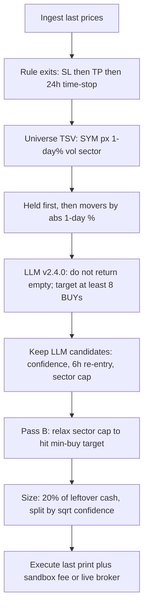

# Pulsar trading profitability — findings and remediation

**Status:** Signed by four independent reviews (quant, code, risk, final sign-off).  
**Scope:** Portfolio auto-trader path (`signals.rs` → prompt `v2.4.0` → `execution.rs` → `risk_exits.rs`). Coach chat is out of scope except where it contradicts the auto-trader.

## Answer

Pulsar is not losing money because the LLM “cannot pick winners.” It is a **forced-deployment loop**: the book is ranked by one-day `|%|`, the prompt pushes toward **at least eight BUY ideas**, and a **24-hour time-stop** recycles in-band lots — including 6-hour cooldown re-entries that inherit `MIN(first BUY ever)` and are already aged out.

**An 80% win rate is not a deliverable.** It is the wrong KPI. At a 5% stop / 10% target / ~1% NGX round-trip, break-even is about **40% winners**. Chasing 80% usually means tiny targets, tiny sample size, or understated fees. The goal is **positive expectancy after venue-accurate costs**, with a floor and ceiling on trades per week.

---

## How a cycle actually decides

The model sees **last price, one-day %, volume, sector, cash, and held PnL**. SMA50/200, RSI14, 20-day momentum, and volume anomaly are computed in `indicators.rs` and **not placed on the portfolio TSV**. The only indicator gate is RSI > 70 on *unheld* names; missing history is treated as “not overbought.”

---

## Why the book bleeds

### 1. Forced activity, not forced fills

Prompt `v2.4.0` says “Do not return an empty signals array” and “Target at least `minBuySignals` BUY ideas.” Rust sets `MIN_BUY_TARGET = 8` and the TypeScript prompt also does `Math.max(1, minBuySignals)`, so even a Rust zero still becomes “at least one BUY.”

Rust does **not** invent tickers. `plan_buy_accept_indices` only relaxes the 3-per-sector cap among names the model already emitted. If the model returns two BUYs, you get two. The damage is that the model is **instructed to spray** on a one-day tape.

Older prompt `v2.0.0` allowed an empty array when nothing was compelling. That permission was removed.

### 2. The working set is yesterday’s movers

`shape_universe_for_llm` ranks unheld names by `|1-day %|` then volume, then round-robins sectors. The retrieval query is “holdings + first 20 TSV lines” — the same movers. The prompt says “BUY when momentum/context supports it” and “Zero volume is allowed.”

Coach’s own system prompt says the opposite: do not recommend buying today’s green names; one-day % is not an edge. Coach does not run `run_cycle`. The auto-trader does.

### 3. 24-hour time-stop recycles noise

Default `time_stop_hours = 24`. On NGX that is overnight plus the next morning, not “one session.” It fires on **in-band** lots (small winners and small losers) to “recycle capital.”

Worse: sandbox `opened_at` is `MIN(executed_at)` of **all** BUYs for that symbol. Live attach uses `MIN(created_at)` of every filled BUY in `broker_orders`. After the first lifetime 24 hours, a 6-hour cooldown re-entry is already aged ≥ 24h and can be sold on the next risk tick. Missing `opened_at` (imported live lots) disables time-stop entirely.

### 4. Take-profit is displayed, not stored

`seed.rs` inserts only `id, name, is_active, allowed_symbols`. `take_profit_pct` stays **NULL**. Rule take-profit requires `tp > 0`, so it never fires. Settings and Coach show **10%** via `?? 0.1` / `TAKE_PROFIT_DISPLAY_DEFAULT` until the user saves. Hard exits are then: 5% stop-loss, 24h time-stop, and discretionary LLM sells.

### 5. Session-long redeploy, not one lot per day

`max_daily_trades` is loaded and unused. Each cycle may spend **20% of remaining cash**. At a 30-minute interval, one NGX session can deploy most of the wallet (`1 − 0.8^n`) before any time-stop fires. Auto-cycle defaults **off**; when enabled, NGX cycles only while the market is open, crypto is 24/7.

### 6. Costs and fills are optimistic

Sandbox default is **0.15% per fill** plus **10 bps** slip (~0.30% + 20 bps round-trip). Live NGX retail all-in is often **well above 1%**. Fills use last print. The names the ranker surfaces (top `|%|`, thin volume) are where last print is least trustworthy. Seeded sandbox history is a ~3% daily RNG walk — a sandbox win rate is not evidence.

### 7. Crypto is the same NGX product

Busha runs the “NGX portfolio trading analyst” prompt, the same 24h stop, the same eight-buy spray, and volume in crypto indicators is hardcoded to 0. A 24/7 venue with a 24h recycle is a different (worse) churn machine.

### 8. Feedback loops that look like learning are not

`confidence_journal` exists and is unused. It scores `horizon_return_pct > 0` (gross price, fees ignored) and mixes stop-loss, time-stop, take-profit, and LLM closes. ASI `week_change` is passed into the prompt but `run_cycle` calls `ingest_market`, which writes ASI **value/points only**. `ingest_indices` (the writer of `week_change`) is never called on the cycle path.

---

## On the 80% success-rate target

| Claim | Verdict |
|---|---|
| “Tune the LLM until 8 of 10 trades win” | Reject. Prompt-only changes cannot fix NULL TP, 24h recycle, or last-print fills on a `|%|` menu. |
| “80% is a stretch goal after we get selective” | Reject. That keeps win rate as the north star. Fewer trades always *can* print a higher hit rate. That is not proof. |
| “Tighten take-profit / widen stop to inflate hit rate” | Reject. Classic ruin: many small wins, rare large losses, fees eat the small wins. |
| “Positive expectancy after live costs, with a trade-count band” | Accept. This is the only honest product sentence. |

A week with 80% winners, one trade, and −8% drawdown is a **fail**. A week with ~48% winners, positive expectancy, profit factor > 1.2, bounded drawdown, and 2–6 honest trades is a **pass**.

---

## Remediation

### Ship first (these change P&L)

1. **Allow sitting in cash.** Restore “empty signals array is valid.” Delete “never empty,” the buy quota, `Math.max(1, minBuySignals)`, “cover at least 3 sectors,” and “BUY when momentum supports it.” Set `MIN_BUY_TARGET = 0`. Delete pass-B sector-cap backfill-to-quota.
2. **Fix lot age, then kill 24h NGX recycle.** Age the *current* open lot, not `MIN(first BUY ever)`. Default NGX `time_stop_hours` to **0**, or recycle **stale/losing lots only** (for example `pnl ≤ 0` or no new high for N sessions). **Do not** set Busha time-stop to 0.
3. **Stop serving the tape as the menu.** Do not sort the LLM working set by `|1-day %|`. Do not retrieve “top 20 movers.” Fail-closed liquidity (drop zero-volume / below a min value-traded floor).
4. **Cap redeploy per session, not per 30 minutes.** Make `max_daily_trades` real, or replace it with max new names / max cash **per day**. Leave cycle budget as a *cycle* cap, not a session refill pump.
5. **Persist take-profit.** Seed and migrate NULL `take_profit_pct` to a stored value that matches Settings (today’s displayed 10%, or an R-multiple vs stop). Do this **after** quota + time-stop + tape-ranking are gone, or TP never tags and only creates a false “2R” story.
6. **Measure like a live book.** Raise sandbox NGX fees/slip into the live all-in ballpark (per venue; do not slap 1% on Busha). Score a journal win as **net PnL > 0**, not gross tick.
7. **Split venues.** Separate prompts, sliders, clocks, fees, stops, and scorecards for NGX vs Busha.

### Do not ship as “alpha”

| Change | Why it dies or backfires |
|---|---|
| Fail-closed “must have SMA50 + RSI 35–62” as product law | Existence check ≠ edge. `<60` bars blanks most Pulse names. Crypto SMA50 is often missing. A comfort-band RSI week looks like 80% on N=5. |
| Time-stop off **while** the 8-buy quota stays | Accumulates yesterday’s movers and holds losers to −5%. Worse than today’s churn. |
| Seed TP=10% **while** 24h time-stop stays on | TP almost never hits. Theater. |
| Close-loop `confidence_journal` to raise the floor | Tiny N, gross WR, mixed exits. Raises the floor into the overconfident cluster, then silence. |
| Blacklist symbols after one losing close | After time-stop shredding, everything “lost.” Universe collapse. |
| Wilder RSI / ATR / R:R gates as the first patch | Correct pedantry, not the P&L event. Fix RSI before any band is frozen. ATR is not computed today. |
| Historical LLM backtest as evidence | Non-deterministic, memory-contaminated, bull-tape friendly. |
| ASI week-down halt on the current ingest path | `week_change` is not written. Gate on NULL = no gate. If populated later, NGX-only; never apply to Busha. |

### Pre-LLM gates that *are* signable

- Liquidity floor (fail-closed).
- Do not buy top-decile one-day melt-ups.
- Optional NGX risk-off when ASI is **actually ingested** and cleanly risk-off. Fail-open if ASI is missing. Never global to Busha.

Put computed indicators **on the TSV** so the model cannot invent RSI. Fail-closed if a *candidate* cannot compute them. Do not hard-require price > SMA50.

Cap **new buys per cycle at 0–3**. Allow zero. Size **down** when N is small — a one-name 20% book is a single NGX gap.

---

## Implementation map (for a follow-up PR)

| Priority | Change | Primary files |
|---|---|---|
| P0 | Empty array legal; kill quota / `Math.max(1,…)` / “never empty” / momentum-buy line | `packages/agent/src/prompt/v2.4.0.ts` |
| P0 | `MIN_BUY_TARGET = 0`; delete pass-B backfill-to-min | `apps/desktop/src-tauri/src/signals.rs` |
| P0 | Lot age = current open, not first BUY | `signals.rs` (`sandbox_lots`, `attach_live_opened_at`) |
| P0 | NGX time-stop default 0 or losers-only; Busha unchanged / longer | `db/mod.rs` default, `risk_exits.rs`, `strategy_coach.rs` |
| P0 | Stop `|pct|` ranking as the LLM working set; liquidity fail-closed | `signals.rs` (`shape_universe_for_llm`, `keep_unheld_for_llm`) |
| P0 | Session/day cash or name cap | `execution.rs` (`max_daily_trades` is already on the row and unused) |
| P0 | Persist `take_profit_pct` in seed + NULL migration; Settings must write what it shows | `seed.rs`, `Settings.tsx`, `strategy_coach.rs` |
| P0 | Per-venue sandbox fee/slip | `settings.rs` |
| P1 | Split NGX vs Busha prompts and param sets | `llm.ts`, `signals.rs`, `strategy_param_sets` |
| P1 | Add rsi/sma50/sma200/mom/volx to TSV (no frozen bands) | `signals.rs`, `indicators.rs` |
| P1 | Call `ingest_indices` on the cycle path if a regime switch is added later | `ingest.rs`, `signals.rs` `run_cycle` |
| P2 | Wilder RSI; journal win = net PnL; do not close-loop the journal | `indicators.rs`, `outcomes.rs` |

---

## Go-live gate (per venue, pre-register before paper)

Do not pool NGX and Busha. Do not claim a hit rate.

- At least **40 closed** paper trades on that venue.
- **Expectancy > 0** after that venue’s fees and slippage (₦ and %).
- **Profit factor** and **max drawdown** vs pre-registered caps.
- **Trades/week** inside a pre-registered band (floor catches inactivity “wins”; ceiling catches the eight-name spray returning).
- Also report: open inventory age, time-to-flat, average R realized vs advertised, N closed.

No historical LLM backtest as a substitute for that gate.

---

## What we will say to the user

We removed (or will remove) structurally losing behavior: forced buys, one-day-mover menus, and 24-hour recycle of in-band lots. We will measure the book like a book — expectancy, profit factor, drawdown, and a honest trade count — not like a win-rate ad.

We will not promise an 80% success rate.
