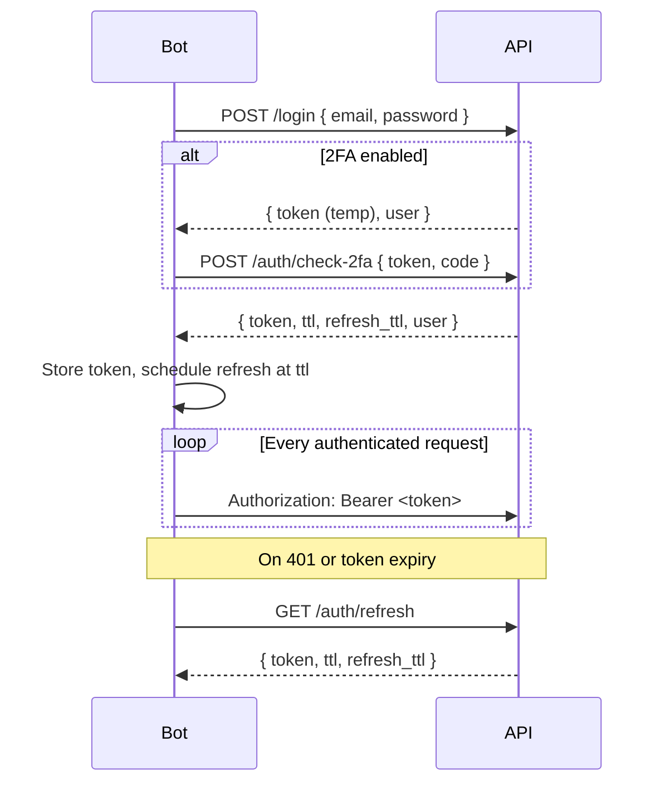
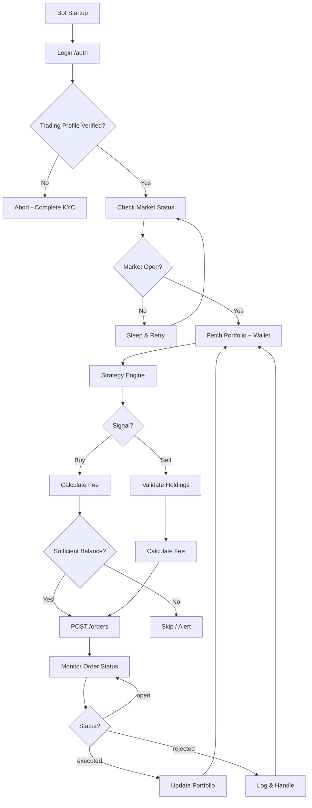

# Coronation Wealth App — API Reference for Automated Trading

> **Source:** Reverse-engineered from the React Native mobile app codebase (`libs/wealth/shared/data-access/api/`).
> **Purpose:** Provide everything needed to build an automated trading bot against the Wealth App REST API.
> **Last updated:** August 2026

---

## Table of Contents

1. [Overview](#1-overview)
2. [Authentication & Session Management](#2-authentication--session-management)
3. [Trading Prerequisites](#3-trading-prerequisites)
4. [Wallet API](#4-wallet-api)
5. [Portfolio API](#5-portfolio-api)
6. [Stocks & Market Data API](#6-stocks--market-data-api)
7. [Order Execution API](#7-order-execution-api)
8. [Automated Trading Bot Workflow](#8-automated-trading-bot-workflow)
9. [Enums & Constants Reference](#9-enums--constants-reference)
10. [Polling & Business Rules](#10-polling--business-rules)
11. [Error Handling](#11-error-handling)
12. [Known Gaps & Limitations](#12-known-gaps--limitations)

---

## 1. Overview

### Base URLs

All endpoints are prefixed with `/v1`.

| Environment | Base URL |
|-------------|----------|
| **Production** | `https://api.wealthapp.coronation.ng/v1` |
| **Staging** | `https://api.stg.wealthapp.coronation.ng/v1` |
| **Development** | `https://wealthapp-api-stg-app.azurewebsites.net/v1` |

### Request Conventions

| Convention | Detail |
|------------|--------|
| **Content-Type** | `application/json` |
| **Auth header** | `Authorization: Bearer <token>` on all protected routes |
| **Field naming** | Request/response bodies use **snake_case** (e.g. `stock_id`, `transaction_type`) |
| **Relations** | Eager-load nested resources via `with[]` query param (e.g. `with[]=stock`) |
| **Pagination** | Standard params: `page`, `per_page`, `order_by`, `desc`, `all`, `query` |
| **Currency** | Nigerian Naira (`NGN`, symbol `₦`) |

### Source Files

| Domain | Primary path |
|--------|-------------|
| API config | `libs/wealth/shared/data-access/api-client/src/configuration.ts` |
| Auth | `libs/wealth/shared/data-access/api/src/auth/` |
| Wallet | `libs/wealth/shared/data-access/api/src/wallet/` |
| Portfolio | `libs/wealth/shared/data-access/api/src/portfolio/` |
| Orders | `libs/wealth/shared/data-access/api/src/order/` |
| Stocks | `libs/wealth/shared/data-access/api/src/stock/` |
| Market status | `libs/wealth/shared/data-access/api/src/market-status/` |

---

## 2. Authentication & Session Management

### 2.1 Login Flow



### 2.2 Auth Endpoints

#### POST `/login`

Authenticate with email and password.

**Auth required:** No

**Request body:**
```json
{
  "email": "user@example.com",
  "password": "your_password"
}
```

**Response (`AuthResponse`):**
```json
{
  "token": "eyJ...",
  "ttl": 60,
  "refresh_ttl": "2026-08-12T15:00:00.000Z",
  "user": { /* User object */ }
}
```

| Field | Type | Description |
|-------|------|-------------|
| `token` | `string` | JWT access token |
| `ttl` | `number` | Token lifetime in **minutes** |
| `refresh_ttl` | `string` | ISO timestamp for refresh token expiry |
| `user` | `User` | Full user profile object |

---

#### POST `/auth/check-2fa`

Complete two-factor authentication after login when 2FA is enabled.

**Auth required:** No (uses temporary token from login step)

**Request body:**
```json
{
  "token": "temporary_token_from_login",
  "code": "123456"
}
```

**Response:** Same as `/login` (`AuthResponse`)

---

#### GET `/auth/refresh`

Refresh an expired access token.

**Auth required:** Session cookie and/or existing token (handled by refresh interceptor)

**Request:** No body

**Response (`RefreshTokenResponse`):**
```json
{
  "token": "eyJ...",
  "ttl": 60,
  "refresh_ttl": "2026-08-12T16:00:00.000Z"
}
```

**Bot implementation notes:**
- Proactively refresh when `now >= tokenIssuedAt + ttl minutes`
- On any `401` from a protected route, call refresh once and retry the original request
- If refresh fails, re-authenticate via `/login`
- The mobile app stores `tokenExpires = now + ttl minutes` in local storage

---

#### POST `/auth/logout`

Invalidate the current session.

**Auth required:** Yes

**Request:** No body

**Response:** `204` / empty

---

#### POST `/register`

Create a new account (not needed for bot operation if account exists).

**Auth required:** No

**Request body:**
```json
{
  "email": "user@example.com",
  "first_name": "John",
  "last_name": "Doe",
  "referral_code": "ABC123"
}
```

**Response:** `User` object (no token — email verification required)

---

#### POST `/auth/verify-email`

Verify email after registration.

**Auth required:** No

**Request body:**
```json
{
  "email": "user@example.com",
  "code": "123456"
}
```

**Response:** `AuthResponse`

---

#### POST `/auth/resend-email-verification-code`

**Auth required:** No

**Request body:**
```json
{ "email": "user@example.com" }
```

---

#### POST `/auth/set-password`

Set password for a newly registered account.

**Auth required:** Yes

**Request body:**
```json
{
  "password": "newpassword",
  "confirm": "newpassword"
}
```

---

#### POST `/auth/forgot-password`

**Auth required:** No

**Request body:**
```json
{ "email": "user@example.com" }
```

---

#### POST `/auth/check-restore-code`

Validate password reset code.

**Auth required:** No

**Request body:**
```json
{
  "email": "user@example.com",
  "code": "123456"
}
```

**Response:**
```json
{ "hash": "reset_hash_token" }
```

---

#### POST `/auth/restore-password`

Complete password reset.

**Auth required:** No

**Request body:**
```json
{
  "password": "newpassword",
  "confirm": "newpassword",
  "token": "reset_hash_token",
  "email": "user@example.com"
}
```

**Response:** `AuthResponse`

---

### 2.3 Session Headers for Bot

Every authenticated request must include:

```http
Authorization: Bearer <access_token>
Content-Type: application/json
Accept: application/json
```

**Public routes** (no Bearer token, no refresh retry on 401):
```
/login, /register, /auth/forgot-password, /auth/restore-password,
/auth/token/check, /auth/verify-email, /auth/resend-email-verification-code,
/auth/set-password, /auth/refresh, /auth/logout
```

**Unauthenticated error messages:**
- `Unauthenticated.`
- `The token has been blacklisted`

---

## 3. Trading Prerequisites

Before placing stock orders, the account must satisfy these conditions (enforced client-side and likely server-side):

### 3.1 Profile Verification

**GET `/profile`**

Fetch user profile including verification state and wallet.

**Auth required:** Yes

**Query params:**
| Param | Type | Default | Description |
|-------|------|---------|-------------|
| `with[]` | `string[]` | various | Relations to include |
| `with_kyc_data` | `boolean` | — | Include KYC data |

**Useful relations for trading bot:**
```
with[]=wallet
with[]=profile_verification_state
with[]=bank
```

**Trading profile status** (`profile_verification_state.trading_profile`):

| Status | Meaning | Bot action |
|--------|---------|------------|
| `incomplete` | Trading profile not filled | Cannot trade — complete profile first |
| `filled` | Submitted, awaiting verification | Cannot trade yet |
| `pending` | Under review | Cannot trade yet |
| `failed` | Verification failed | Cannot trade — fix and resubmit |
| `verified` | Approved | **Ready to trade** |

### 3.2 NGX Customer Creation

**POST `/users/create-ngx-customer`**

Creates the NGX (Nigerian Exchange) brokerage customer record. The mobile app auto-calls this when personal profile is filled but trading profile is incomplete.

**Auth required:** Yes

**Request:** No body

**Response:** Empty / void

**Bot note:** Ensure this has been called successfully before attempting stock orders. Check via profile `trading_profile` status.

### 3.3 Market Must Be Open

**GET `/market-status`**

**Auth required:** Yes (inferred from app usage)

**Response:**
```json
{
  "is_opened": true
}
```

The mobile app **only shows buy/sell buttons when `is_opened === true`**. Your bot should check this before placing market orders.

---

## 4. Wallet API

Wallet data is primarily accessed via the profile relation. There is no standalone `GET /wallet` endpoint.

### 4.1 Wallet Model (via GET `/profile?with[]=wallet`)

```json
{
  "id": 1,
  "current_balance": 150000.00,
  "available_balance": 120000.00,
  "brokerage_balance": 80000.00,
  "has_pending_transactions": false
}
```

| Field | Description |
|-------|-------------|
| `current_balance` | Total wallet balance |
| `available_balance` | Withdrawable balance |
| `brokerage_balance` | **Trading/brokerage account balance** — funds available for stock trades |
| `has_pending_transactions` | Whether any wallet transactions are pending |

**Critical for trading bot:** Stock orders do **not** call a payment API. Trades are funded from `brokerage_balance`. Ensure sufficient brokerage balance before placing buy orders.

### 4.2 POST `/wallet/withdraw`

Withdraw funds from wallet to linked bank account.

**Auth required:** Yes

**Request body:**
```json
{
  "amount": 50000
}
```

**Response:** Empty / void

**Side effect:** Invalidates profile cache (wallet balance refreshed on next profile fetch)

---

### 4.3 Wallet Transactions

**Base path:** `/wallet/transactions`

#### GET `/wallet/transactions`

List wallet deposit/withdrawal history.

**Auth required:** Yes

**Query params:**
| Param | Type | Description |
|-------|------|-------------|
| `page` | `number` | Page number |
| `per_page` | `number` | Items per page (app uses 20) |
| `order_by` | `string` | `transaction_date` |
| `desc` | `boolean` | Sort descending |
| `query` | `string` | Search filter |
| `all` | `boolean` | Return all records |

**Response (`PaginationResponse<WalletTransaction>`):**
```json
{
  "data": [
    {
      "id": 1,
      "wallet_id": 1,
      "amount": 100000,
      "fee": 0,
      "type": "deposit",
      "unique_reference": "PAY_abc123",
      "currency": "NGN",
      "status": "confirmed",
      "transaction_date": "2026-08-12T10:00:00.000Z"
    }
  ],
  "pagination": {
    "current_page": 1,
    "per_page": 20,
    "total": 50
  }
}
```

#### GET `/wallet/transactions/{id}`

Get a single wallet transaction.

#### POST `/wallet/transactions/paystack`

Verify a Paystack card deposit (used by mobile top-up flow, not stock trades).

**Request body:**
```json
{
  "reference": "paystack_payment_reference"
}
```

**Response:** `WalletTransaction`

---

## 5. Portfolio API

### 5.1 GET `/portfolio`

Get the user's complete portfolio including stock holdings and mutual funds.

**Auth required:** Yes

**Query params:**
| Param | Type | Default | Description |
|-------|------|---------|-------------|
| `with[]` | `string[]` | `stocks.stock,mutual_funds,mutual_funds.mutual_fund` | Relations |

**Valid `with` values:**
- `stocks`
- `stocks.stock`
- `mutual_funds`
- `mutual_funds.mutual_fund`

**Response (`Portfolio`):**
```json
{
  "id": 1,
  "balance": 500000.00,
  "profit": 25000.00,
  "stock_value": 300000.00,
  "fund_value": 200000.00,
  "pending_fund_value": 0,
  "stocks": [
    {
      "id": 1,
      "stock_id": 42,
      "quantity": 100,
      "current_value": 150000.00,
      "value_change": 5000.00,
      "value_change_percent": 3.45,
      "stock": {
        "id": 42,
        "symbol": "DANGCEM",
        "company_name": "Dangote Cement Plc",
        "close_price": 1500.00,
        "price": 1500.00
      }
    }
  ],
  "mutual_funds": []
}
```

**Bot usage:** Poll every 30s to track holdings, P&L, and available stock positions for sell decisions.

---

### 5.2 GET `/portfolio/analytics`

Sector allocation breakdown.

**Auth required:** Yes

**Query params:**
| Param | Type | Default |
|-------|------|---------|
| `all` | `boolean` | `true` |
| `order_by` | `string` | `value` |
| `desc` | `boolean` | `true` |
| `page`, `per_page` | `number` | — |

**Response:**
```json
{
  "data": [
    {
      "id": 1,
      "portfolio_id": 1,
      "sector": "Industrial Goods",
      "value": 150000.00,
      "percent": 50.0
    }
  ],
  "pagination": {}
}
```

---

### 5.3 GET `/portfolio/orders`

Order history (placed orders, not executed trade events).

**Auth required:** Yes

**Query params:**
| Param | Type | Description |
|-------|------|-------------|
| `status` | `string` | Filter: `open`, `executed`, `rejected` |
| `order_by` | `string` | `order_date`, `trade_date`, `created_at`, `updated_at` |
| `desc` | `boolean` | Sort direction |
| `with[]` | `string[]` | `stock` |
| `page`, `per_page` | `number` | Pagination |

**Response:** `PaginationResponse<Order>` (see [Order model](#72-order-model))

**App usage by tab:**
| Tab | Params |
|-----|--------|
| Open orders | `status=open`, `order_by=order_date`, `desc=true` |
| Executed | `status=executed`, `order_by=trade_date`, `desc=true` |
| Rejected | `status=rejected`, `order_by=trade_date`, `desc=true` |

---

### 5.4 GET `/portfolio/orders/{id}`

Get a single order by ID.

---

### 5.5 GET `/portfolio/transactions`

Executed trade events (filled buy/sell transactions).

**Auth required:** Yes

**Query params:**
| Param | Type | Description |
|-------|------|-------------|
| `order_by` | `string` | `date`, `created_at`, `updated_at` |
| `with[]` | `string[]` | `stock` |
| `page`, `per_page` | `number` | Pagination |

**Response (`PortfolioTransaction`):**
```json
{
  "id": 1,
  "quantity": 100,
  "price": 1500.00,
  "fee": 112.50,
  "gross_amount": 150112.50,
  "type": "buy",
  "date": "2026-08-12T14:30:00.000Z",
  "stock": { /* Stock object */ }
}
```

---

## 6. Stocks & Market Data API

### 6.1 GET `/stocks`

Search and list stocks.

**Auth required:** Yes

**Query params:**
| Param | Type | Description |
|-------|------|-------------|
| `query` | `string` | Search by symbol/company name |
| `sector[]` | `string[]` | Filter by sector name |
| `page`, `per_page` | `number` | Pagination |
| `order_by` | `string` | `created_at`, `updated_at` |
| `desc` | `boolean` | Sort direction |
| `all` | `boolean` | Return all |

**Response:** `PaginationResponse<Stock>`

---

### 6.2 GET `/stocks/{id}`

Get a single stock with market data and user's holding (if any).

**Auth required:** Yes

**Response (`Stock`):**
```json
{
  "id": 42,
  "symbol": "DANGCEM",
  "company_name": "Dangote Cement Plc",
  "icon_url": "https://...",
  "price": 1500.00,
  "close_price": 1500.00,
  "change": 25.00,
  "change_percent": 1.69,
  "volume": 1500000,
  "average_daily_volume": 2000000,
  "previous_closing_price": 1475.00,
  "high_price": 1510.00,
  "low_price": 1470.00,
  "week_high_52": 1800.00,
  "week_low_52": 1200.00,
  "pe_ratio": 12.5,
  "market_cap": 2550000000000,
  "earnings_per_share": 120.00,
  "dividend_yield": 8.5,
  "is_favorite": false,
  "portfolio": {
    "current_value": 150000.00,
    "value_change": 5000.00,
    "value_change_percent": 3.45,
    "buy_price": 1450.00,
    "quantity": 100
  }
}
```

**Bot usage:** Poll every 10s during active trading, 30s otherwise. The `portfolio` nested object tells you current holdings for sell quantity validation.

---

### 6.3 GET `/stocks/actively-trading`

List currently active/high-volume stocks.

**Auth required:** Yes

**Response:** `PaginationResponse<Stock>` (no pagination params needed)

---

### 6.4 GET `/stocks/top-growth`

Top gaining stocks.

**Auth required:** Yes

**Response:** `PaginationResponse<Stock>`

---

### 6.5 GET `/stocks/top-loose`

Top losing stocks.

**Auth required:** Yes

**Response:** `PaginationResponse<Stock>`

---

### 6.6 POST `/stocks/fee`

Calculate trading fees before placing an order.

**Auth required:** Yes

**Request body:**
```json
{
  "stock_id": 42,
  "quantity": 100,
  "order_type": "market_price",
  "limit_price": 1500.00
}
```

**Response:**
```json
{
  "accurate_fee": 112.4875,
  "rounded_fee": 112.50
}
```

**Bot usage:** Always call this before placing orders to validate affordability. Use `rounded_fee` for total cost calculation:

```
total_cost = (price × quantity) + rounded_fee   // for buy
total_proceeds = (price × quantity) - rounded_fee  // for sell
```

---

### 6.7 GET `/stocks/sectors`

List available stock sectors for filtering.

**Auth required:** Yes

**Response:**
```json
{
  "data": [
    { "id": 1, "name": "Industrial Goods" },
    { "id": 2, "name": "Banking" }
  ]
}
```

---

### 6.8 GET `/stocks/{stockId}/news`

News articles for a stock.

**Auth required:** Yes

**Query params:** `page`, `per_page`, `order_by=created_at`, `desc=true`

**Response:**
```json
{
  "data": [
    { "id": 1, "title": "Dangote reports Q2 earnings", "url": "https://..." }
  ]
}
```

---

### 6.9 Favorites

**Base path:** `/stocks/favorites`

| Method | Path | Description |
|--------|------|-------------|
| GET | `/stocks/favorites` | List favorite stocks |
| POST | `/stocks/favorites?stock_id=42` | Add favorite (stock_id as **query param**) |
| DELETE | `/stocks/favorites/{stockId}` | Remove favorite |

---

## 7. Order Execution API

This is the **core API for automated trading**.

### 7.1 POST `/orders` — Place Order

**Auth required:** Yes

**Request body:**

**Market order (buy or sell):**
```json
{
  "stock_id": 42,
  "transaction_type": "buy",
  "quantity": 100,
  "type": "market_price",
  "with": ["stock"]
}
```

**Limit order (buy or sell):**
```json
{
  "stock_id": 42,
  "transaction_type": "sell",
  "quantity": 50,
  "type": "limit_order",
  "price_limit": 1550.00,
  "is_execute_today": true,
  "with": ["stock"]
}
```

**Request fields:**

| Field | Type | Required | Description |
|-------|------|----------|-------------|
| `stock_id` | `number` | Yes | Stock ID |
| `transaction_type` | `string` | Yes | `buy` or `sell` |
| `quantity` | `number` | Yes | Number of shares (max `2147483647`; sell max = current holding) |
| `type` | `string` | Yes | `market_price` or `limit_order` |
| `price_limit` | `number` | Limit only | Target price per share |
| `is_execute_today` | `boolean` | Limit only | `true` = day order; `false` = good-till-canceled |
| `with` | `string[]` | No | Include relations in response (e.g. `["stock"]`) |

**Important serialization rules (from mobile app):**
- For **market orders**: omit `price_limit` and `is_execute_today` from the request body entirely
- For **limit orders**: include both `price_limit` and `is_execute_today`
- The app auto-sets `price_limit = stock.close_price` for market orders internally but does **not** send it

**Response (`Order`):**
```json
{
  "id": 123,
  "stock_id": 42,
  "transaction_type": "buy",
  "status": "open",
  "type": "market_price",
  "quantity": 100,
  "estimated_amount": 150112.50,
  "quote_price": 1500.00,
  "price_limit": null,
  "unit_price": null,
  "is_execute_today": false,
  "order_date": "2026-08-12T14:30:00.000Z",
  "trade_date": null,
  "rejection_reason": null,
  "stock": { /* Stock object if with=stock */ }
}
```

---

### 7.2 POST `/orders/{id}/cancel` — Cancel Order

Cancel an open order.

**Auth required:** Yes

**Request:** Order ID in URL path. No body.

**Response:** Empty / void

**Bot usage:** Only open orders (`status=open`) can be canceled. Poll `/portfolio/orders?status=open` to find cancelable orders.

---

### 7.3 Order Model

| Field | Type | Description |
|-------|------|-------------|
| `id` | `number` | Order ID |
| `stock_id` | `number` | Stock ID |
| `transaction_type` | `string` | `buy` \| `sell` |
| `status` | `string` | `open` \| `executed` \| `rejected` |
| `type` | `string` | `market_price` \| `limit_order` |
| `quantity` | `number` | Share quantity |
| `estimated_amount` | `number\|null` | Estimated total including fees |
| `quote_price` | `number\|null` | Price at time of order |
| `price_limit` | `number\|null` | Limit price (limit orders) |
| `unit_price` | `number\|null` | Execution price (executed orders) |
| `is_execute_today` | `boolean` | Day order vs GTC |
| `order_date` | `datetime\|null` | When order was placed |
| `trade_date` | `datetime\|null` | When order was executed |
| `rejection_reason` | `string\|null` | Why order was rejected |

**Order status lifecycle:**
```
POST /orders → open → executed (filled)
                   → rejected (failed)
                   → canceled (via POST /orders/{id}/cancel)
```

---

## 8. Automated Trading Bot Workflow

### 8.1 Startup Sequence

```
1. POST /login                          → obtain token
2. GET  /profile?with[]=wallet          → check brokerage_balance
         &with[]=profile_verification_state
3. Verify trading_profile == "verified"
4. GET  /market-status                  → confirm is_opened == true
5. GET  /portfolio?with[]=stocks.stock  → load current holdings
```

### 8.2 Buy Workflow

```
1. GET  /stocks/{id}                    → get current price & close_price
2. POST /stocks/fee                     → calculate fees
3. Verify: (price × qty) + fee <= brokerage_balance
4. POST /orders                         → place buy order
5. Poll GET /portfolio/orders?status=open&order_by=order_date
   until status changes to executed or rejected
6. On rejection: log rejection_reason, optionally retry
```

### 8.3 Sell Workflow

```
1. GET  /stocks/{id}                    → get portfolio.quantity (max sell qty)
2. Verify: quantity <= portfolio.quantity
3. POST /stocks/fee                     → calculate fees
4. POST /orders { transaction_type: "sell", ... }
5. Poll order status until executed/rejected
```

### 8.4 Limit Order Management

```
1. POST /orders { type: "limit_order", price_limit, is_execute_today }
2. Poll GET /portfolio/orders?status=open
3. If price no longer favorable: POST /orders/{id}/cancel
4. If is_execute_today=true and market closes: order may expire
5. If is_execute_today=false: order persists (GTC) until filled or canceled
```

### 8.5 Monitoring Loop (Pseudocode)

```python
while market_open:
    # Refresh token if needed
    if token_expired():
        refresh_token()

    # Check market
    market = GET("/market-status")
    if not market.is_opened:
        sleep(60)
        continue

    # Update portfolio
    portfolio = GET("/portfolio?with[]=stocks.stock")
    wallet = GET("/profile?with[]=wallet")

    # Run strategy logic
    for signal in strategy.generate_signals(portfolio):
        stock = GET(f"/stocks/{signal.stock_id}")
        fee = POST("/stocks/fee", {
            "stock_id": signal.stock_id,
            "quantity": signal.quantity,
            "order_type": signal.order_type,
            "limit_price": signal.price
        })

        if signal.type == "buy":
            cost = signal.price * signal.quantity + fee.rounded_fee
            if wallet.brokerage_balance >= cost:
                order = POST("/orders", build_order(signal))
                track_order(order.id)
        elif signal.type == "sell":
            if stock.portfolio.quantity >= signal.quantity:
                order = POST("/orders", build_order(signal))
                track_order(order.id)

    # Check pending orders
    open_orders = GET("/portfolio/orders?status=open")
    for order in open_orders:
        if should_cancel(order):
            POST(f"/orders/{order.id}/cancel")

    sleep(POLL_INTERVAL)
```

### 8.6 Architecture Diagram



---

## 9. Enums & Constants Reference

### Order Types
| Value | Description |
|-------|-------------|
| `market_price` | Execute at current market price |
| `limit_order` | Execute only at specified price or better |

### Order Status
| Value | Description |
|-------|-------------|
| `open` | Order placed, awaiting execution |
| `executed` | Order filled |
| `rejected` | Order rejected by exchange/broker |

### Transaction Types
| Value | Description |
|-------|-------------|
| `buy` | Purchase shares |
| `sell` | Sell shares |

### Wallet Transaction Types
| Value | Description |
|-------|-------------|
| `deposit` | Funds added to wallet |
| `withdrawal` | Funds withdrawn from wallet |

### Wallet Transaction Status
| Value | Description |
|-------|-------------|
| `pending` | Processing |
| `confirmed` | Completed |
| `canceled` | Canceled |
| `failed` | Failed |

### Profile Verification Status
| Value | Description |
|-------|-------------|
| `incomplete` | Not started |
| `filled` | Submitted |
| `pending` | Under review |
| `failed` | Failed verification |
| `verified` | Approved |

### App Constants (from `constants.ts`)
| Constant | Value | Usage |
|----------|-------|-------|
| `maxNumberValue` | `2147483647` | Max quantity for buy orders |
| `defaultCurrency.code` | `NGN` | Nigerian Naira |
| `refetchBuyOrSellStockInterval` | `10000` ms | Stock price polling during order form |
| `refetchStockIntervalMS` | `30000` ms | Stock details polling |
| `refetchMarketStatusIntervalMS` | `30000` ms | Market status polling |
| `portfolioPollingIntervalMS` | `30000` ms | Portfolio polling |

---

## 10. Polling & Business Rules

### Recommended Polling Intervals

| Resource | Interval | Endpoint |
|----------|----------|----------|
| Market status | 30s | `GET /market-status` |
| Portfolio | 30s | `GET /portfolio` |
| Stock price (idle) | 30s | `GET /stocks/{id}` |
| Stock price (trading) | 10s | `GET /stocks/{id}` |
| Open orders | 15–30s | `GET /portfolio/orders?status=open` |
| Token refresh | Before expiry | `GET /auth/refresh` |

### Client-Side Validation Rules

| Rule | Detail |
|------|--------|
| Market must be open | Buy/sell only when `is_opened === true` |
| Sell quantity cap | Cannot sell more than `stock.portfolio.quantity` |
| Buy quantity cap | Max `2,147,483,647` shares |
| Market order body | Must omit `price_limit` and `is_execute_today` |
| Limit order body | Must include `price_limit` and `is_execute_today` |
| Fee debounce | App recalculates fees after 300ms of input change |
| Profile required | Portfolio fetch skipped until profile is verified |

### Order Execution Types (Limit Orders)

| `is_execute_today` | Label in app | Behavior |
|---------------------|-------------|----------|
| `true` | Execute Today | Day order — expires end of trading day |
| `false` | Good Till Canceled | Persists until filled or manually canceled |

---

## 11. Error Handling

### HTTP Status Codes

The API uses standard HTTP status codes. The mobile app handles:

| Code | Action |
|------|--------|
| `401` | Attempt token refresh via `GET /auth/refresh`, then retry once |
| `401` (after refresh fails) | Force logout / re-login |
| `422` | Validation errors (field-level messages) |
| `503` | Service unavailable — show retry message |

### Auth Errors
- `Unauthenticated.` — Token missing or invalid
- `The token has been blacklisted` — Token revoked, must re-login

### Order Rejection
When an order is rejected, check `rejection_reason` on the order object via `GET /portfolio/orders/{id}`.

---

## 12. Known Gaps & Limitations

| Gap | Impact on Bot |
|-----|---------------|
| **No stock price history/chart API** | Cannot backtest using API historical data; `StockChartData` is a mock placeholder |
| **No WebSocket/streaming** | Must poll for price updates and order status |
| **No explicit fund-wallet → brokerage transfer API** | Brokerage funding mechanism not exposed; balance must exist in `brokerage_balance` |
| **No documented rate limits** | Implement conservative polling (≥10s) to avoid throttling |
| **No `/auth/token/check` client implementation** | Route listed as public but no RTK endpoint defined |
| **Payment API is mutual-fund only** | `/payments/*` endpoints not used for stock trades |
| **Request encryption flag** | When Unleash flag `encrypt-data` is enabled, sensitive endpoints (`/profile`, `/users/*`) encrypt POST/PUT bodies with `EXPO_PUBLIC_APP_ENCRYPTION_KEY` — unlikely to affect stock/order endpoints |
| **2FA support** | Bot must handle `POST /auth/check-2fa` if account has 2FA enabled |
| **No order amend API** | Cannot modify an open order — must cancel and re-place |

---

## Appendix A: Complete Endpoint Index

### Auth
| Method | Path | Auth |
|--------|------|------|
| POST | `/login` | No |
| POST | `/auth/check-2fa` | No |
| POST | `/register` | No |
| POST | `/auth/verify-email` | No |
| POST | `/auth/resend-email-verification-code` | No |
| GET | `/auth/refresh` | Session |
| POST | `/auth/set-password` | Yes |
| POST | `/auth/forgot-password` | No |
| POST | `/auth/check-restore-code` | No |
| POST | `/auth/restore-password` | No |
| POST | `/auth/logout` | Yes |

### Profile (Trading Prerequisites)
| Method | Path | Auth |
|--------|------|------|
| GET | `/profile` | Yes |
| PUT | `/profile` | Yes |
| DELETE | `/profile` | Yes |
| POST | `/users/create-ngx-customer` | Yes |

### Wallet
| Method | Path | Auth |
|--------|------|------|
| GET | `/profile?with[]=wallet` | Yes |
| POST | `/wallet/withdraw` | Yes |
| GET | `/wallet/transactions` | Yes |
| GET | `/wallet/transactions/{id}` | Yes |
| POST | `/wallet/transactions/paystack` | Yes |

### Portfolio
| Method | Path | Auth |
|--------|------|------|
| GET | `/portfolio` | Yes |
| GET | `/portfolio/analytics` | Yes |
| GET | `/portfolio/orders` | Yes |
| GET | `/portfolio/orders/{id}` | Yes |
| GET | `/portfolio/transactions` | Yes |
| GET | `/portfolio/transactions/{id}` | Yes |

### Stocks & Market
| Method | Path | Auth |
|--------|------|------|
| GET | `/market-status` | Yes |
| GET | `/stocks` | Yes |
| GET | `/stocks/{id}` | Yes |
| GET | `/stocks/actively-trading` | Yes |
| GET | `/stocks/top-growth` | Yes |
| GET | `/stocks/top-loose` | Yes |
| POST | `/stocks/fee` | Yes |
| GET | `/stocks/sectors` | Yes |
| GET | `/stocks/{id}/news` | Yes |
| GET | `/stocks/favorites` | Yes |
| POST | `/stocks/favorites?stock_id={id}` | Yes |
| DELETE | `/stocks/favorites/{id}` | Yes |

### Orders (Trading)
| Method | Path | Auth |
|--------|------|------|
| POST | `/orders` | Yes |
| POST | `/orders/{id}/cancel` | Yes |

---

## Appendix B: Example cURL Commands

### Login
```bash
curl -X POST https://api.wealthapp.coronation.ng/v1/login \
  -H "Content-Type: application/json" \
  -d '{"email":"user@example.com","password":"secret"}'
```

### Check Market Status
```bash
curl https://api.wealthapp.coronation.ng/v1/market-status \
  -H "Authorization: Bearer $TOKEN"
```

### Get Portfolio
```bash
curl "https://api.wealthapp.coronation.ng/v1/portfolio?with[]=stocks.stock" \
  -H "Authorization: Bearer $TOKEN"
```

### Calculate Fee
```bash
curl -X POST https://api.wealthapp.coronation.ng/v1/stocks/fee \
  -H "Authorization: Bearer $TOKEN" \
  -H "Content-Type: application/json" \
  -d '{"stock_id":42,"quantity":100,"order_type":"market_price","limit_price":1500}'
```

### Place Market Buy Order
```bash
curl -X POST https://api.wealthapp.coronation.ng/v1/orders \
  -H "Authorization: Bearer $TOKEN" \
  -H "Content-Type: application/json" \
  -d '{"stock_id":42,"transaction_type":"buy","quantity":100,"type":"market_price","with":["stock"]}'
```

### Place Limit Sell Order
```bash
curl -X POST https://api.wealthapp.coronation.ng/v1/orders \
  -H "Authorization: Bearer $TOKEN" \
  -H "Content-Type: application/json" \
  -d '{"stock_id":42,"transaction_type":"sell","quantity":50,"type":"limit_order","price_limit":1550,"is_execute_today":true,"with":["stock"]}'
```

### Cancel Order
```bash
curl -X POST https://api.wealthapp.coronation.ng/v1/orders/123/cancel \
  -H "Authorization: Bearer $TOKEN"
```

### List Open Orders
```bash
curl "https://api.wealthapp.coronation.ng/v1/portfolio/orders?status=open&order_by=order_date&desc=true&with[]=stock&per_page=10" \
  -H "Authorization: Bearer $TOKEN"
```
